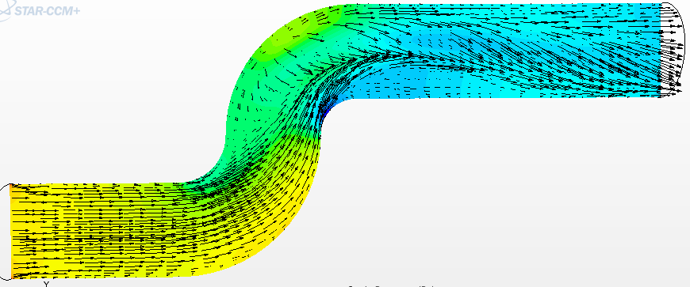

# Engineering Case Studies

Real engineering studies focused on technical problem solving,
system optimization and industrial performance improvement.

The objective is not only to generate engineering analyses,
but to understand technical problems,
identify limitations
and propose practical engineering improvements.

---

# Engineering focus

• industrial system optimization  
• airflow behavior  
• thermal management  
• mechanical validation  
• process efficiency  
• engineering interpretation  
• technical problem solving  

---

# Included case studies

## Industrial Filtration Station

Analysis and optimization
of industrial airflow filtration systems.

---

## Airflow System Optimization

Investigation of unstable airflow regions
and pressure loss reduction opportunities.

---

## Thermal Management Study

Thermal behavior analysis
and cooling system improvement.

---

## Mechanical System Validation

Structural validation
of mechanical engineering systems.

---

## Industrial Process Analysis

Engineering analysis
of complex industrial process behavior.

---

## Engineering Design Optimization

Technical optimization studies
focused on performance improvement
and operational efficiency.

---

# Engineering approach

These case studies focus on real engineering understanding,
technical interpretation and practical optimization opportunities.

The purpose is not only to visualize engineering behavior,
but to help improve industrial systems
through analysis-driven engineering decisions.
